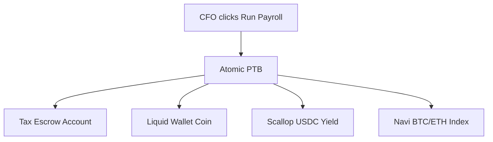

# 🌊 Sluice

> **One-click atomic Web3 payroll** that streams payments, withholds taxes, and auto-allocates employee earnings into yield-bearing DeFi positions and savings vaults — all in a single transaction on Sui.

---

## 🛑 The Pain Points

Managing cross-border Web3 payroll is currently a fragmented nightmare:
* 💸 **Inefficient Rails:** SWIFT wires take 1–5 business days, cost £20–£40 per transaction, and suffer a 4–8% failure rate at intermediary banks.
* 🧩 **Broken DeFi Loops:** Existing crypto payrolls just dump stablecoins into a wallet. Employees must manually swap, transfer, and deposit into yield protocols, creating friction and massive tax-tracking headaches.
* 📑 **Compliance Chaos:** Employers compute withholding taxes in separate systems, with zero cryptographic guarantees that gross pay equals net plus taxes. Auditors are left reconciling chaotic CSV files.
* ⚙️ **No Employee Automation:** Workers cannot programmatically route their pay. Every crypto-native contributor reconstructs manual scripts just to split their monthly income.

---

## ⚡ The Solution: Sluice

**Sluice** turns a corporate payroll run into a single **Programmable Transaction Block (PTB)** on Sui. 

### How it works:
1. **One-Click Payroll Runs:** Employers fund a shared `Payroll` object with USDC. On payday, a single PTB iterates over all active employees to execute gross-to-net splits atomically.
2. **Atomic Multi-Leg Routing:** In a sub-400ms transaction, Sluice transfers net pay, locks tax withholding in a segregated escrow, and routes the remainder into Scallop/Navi yield vaults and liquid balances.
3. **Decentralised Control (`AllocationCap`):** Employees hold their own `AllocationCap` Move object, allowing them to adjust their yield/savings ratios via a Web interface. Employers never custody or manage employee investment choices.
4. **On-Chain Audit Trails:** Every payroll run emits a signed compliance event (gross, net, withholding, FX snapshots from Pyth) for instant auditor replay.

---

## 🛠️ Sui Primitives & Ecosystem Stack

Sluice leverages the unique strengths of the Sui network to achieve what is impossible on EVM without complex flashloan choreography:

* **Sui Programmable Transaction Blocks (PTB):** Powers the atomic multi-leg routing (Pay → Withhold → Supply to Yield) for up to 50 employees in a single transaction.
* **Move Object Model:** Treats employee profiles and routing configurations as secure, employee-owned `AllocationCap` objects.
* **zkLogin & Sponsored Transactions:** New hires onboard instantly via Google auth. Sluice sponsors their first transaction, removing the need for gas token acquisition on day one.
* **DeFi Integrations:** Deeply integrated with **Scallop** and **Navi** for yield generation and **Pyth** for real-time FX rate snapshots.

---

## 🚀 MVP Roadmap

* **Employer Dashboard:** Manage employee database, configure tax withholdings, and execute atomic payroll.
* **Employee PWA:** zkLogin onboarding, drag-and-drop allocation sliders, and live portfolio tracking.
* **On-Chain Module:** Core `payroll`, `allocation`, and `compliance` modules with full test coverage.
* **Auditor attestation:** Export cryptographically verifiable PDF receipts.
